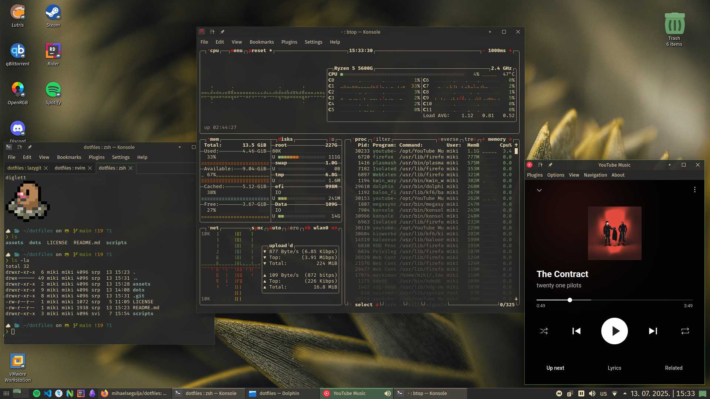
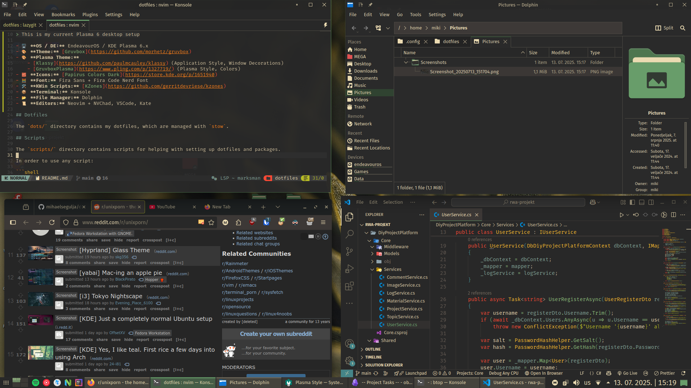
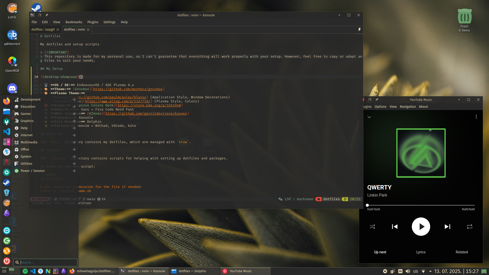

# dotfiles

My dotfiles and setup scripts

> [!IMPORTANT]
> This repository is made for my personal use, so I can't guarantee that everything will work properly with your setup. However, feel free to copy or adapt any files to suit your needs.

## My Setup







- 🖥️ **OS / DE:** EndeavourOS / KDE Plasma 6.x
- 🎨 **Theme:** [Gruvbox](https://github.com/morhetz/gruvbox)
- 🎨 **Plasma Theme:**
  - [Klassy](https://github.com/paulmcauley/klassy) (Application Style, Window Decorations)
  - [GruvboxPlasma](https://www.pling.com/p/1327719/) (Plasma Style, Colors)
- 🧱 **Icons:** [Papirus Colors Dark](https://store.kde.org/p/1651940)
- 🧮 **Font:** Fira Sans + Fira Code Nerd Font
- 🛠️ **KWin Scripts:** [KZones](https://github.com/gerritdevriese/kzones)
- 📦 **Terminal:** Konsole
- 📂 **File Manager:** Dolphin
- 📜 **Editors:** Neovim + NVChad, VSCode, Kate
- 🖼️ **Wallpaper:** [here](assets/wallpaper001.jpg)

## Dotfiles

The `dots/` directory contains my dotfiles, which are managed with `stow`.

## Scripts

The `scripts/` directory contains scripts for helping with setting up dotfiles and packages.

In order to use any script:

```shell
cd scripts/

# Add execution permission for the file if needed:
chmod +x ./script_name.sh

# Run the script:
./script_name.sh
```

`stow_dotfiles.sh`

- Symlinks all dotfiles from `dots/` using `stow`

- You can also pass the flag `-D` or `--unstow` to unstow dotfiles

`install_packages_arch.sh`

- Installs Arch and Flatpak packages from package lists (`scripts/pkglists/`)

## Other

### Oh My Zsh

Install [Oh My Zsh](https://github.com/ohmyzsh/ohmyzsh):

```shell
sh -c "$(curl -fsSL https://raw.githubusercontent.com/ohmyzsh/ohmyzsh/master/tools/install.sh)"
```

### VSCode extensions

To restore (install) extensions from list:

```shell
cd dots/vscode/

cat extensions-list.txt | xargs -n 1 code --install-extension
```

To backup current extensions:

```shell
code --list-extensions > extensions-list.txt
```
